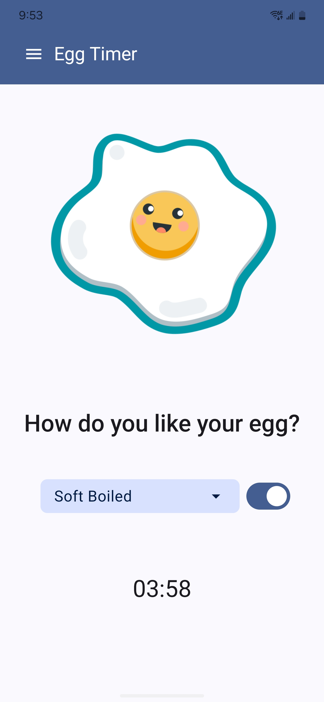
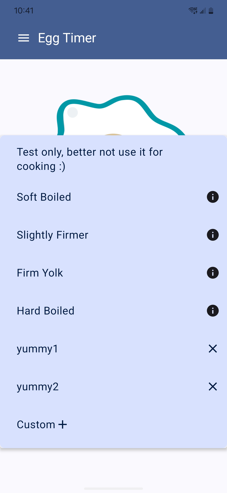
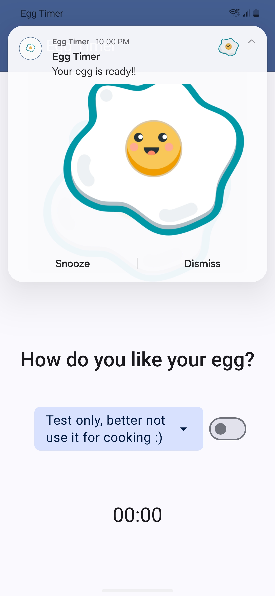
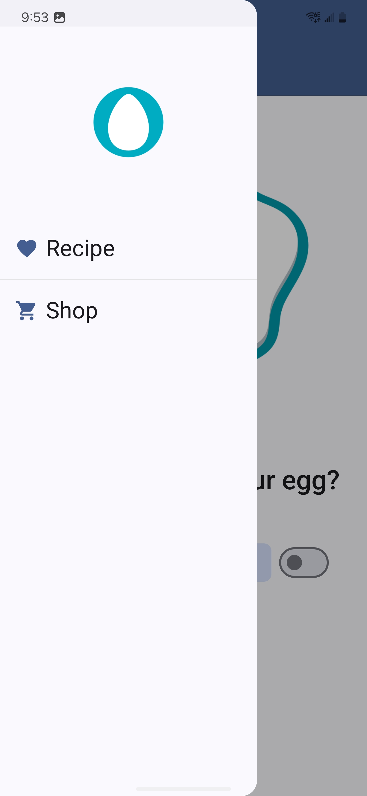
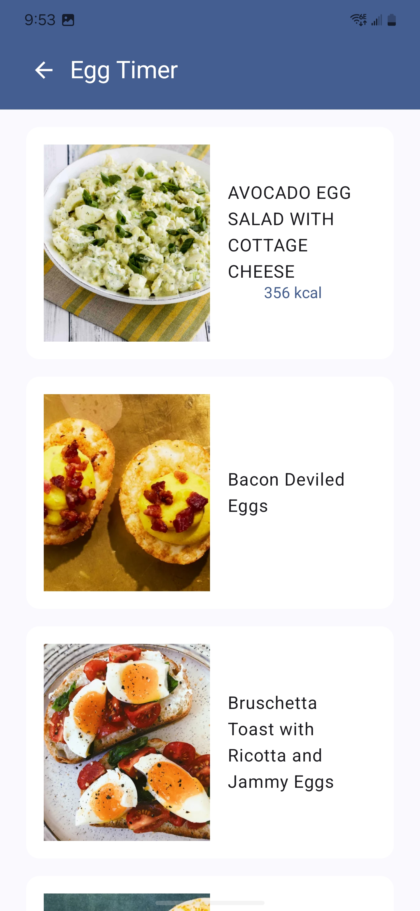
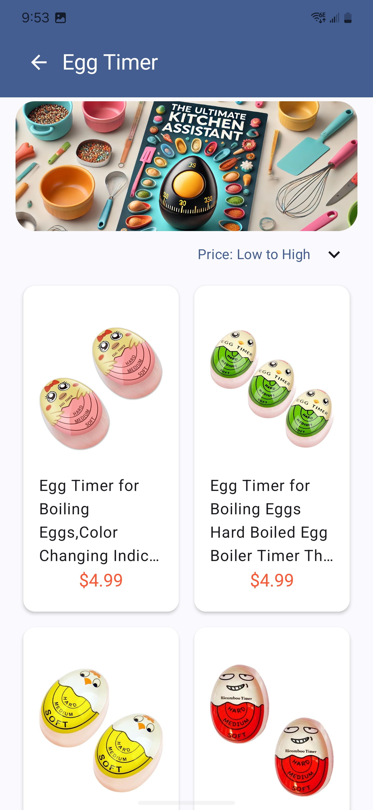
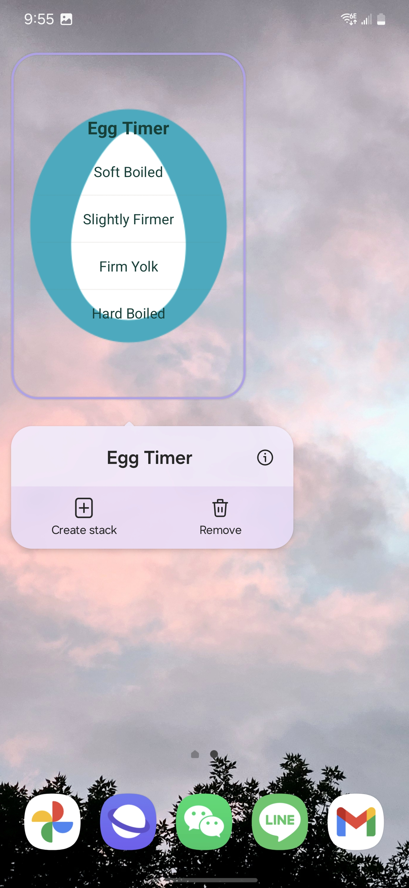

# Egg Timer App

The Egg Timer App is an Android application designed to help users cook eggs to their desired doneness (with four predefined doneness levels and any customized doneness). The app features notifications, integration with Android app widgets, and displays recipes and various physical egg timer products.

## Features

- **User Notifications**: The app notifies users when the egg timer is done.
- **Four Predefined Doneness Levels**: Choose from four predefined doneness levels for cooking eggs.
- **Customized Doneness**: Set custom timers for any desired doneness.
- **Android Widgets Integration**: Use Android widgets to start and check timers directly from the home screen.
- **Recipe Display**: View recipes related to cooking eggs within the app.
- **Physical Egg Timer Display**: A series of physical egg timer products are displayed within the app.
- **Firebase Integration**: Products and recipe information are stored in Firebase.
- **No Backend Service**: The app operates entirely on the client-side without needing a backend service.

## App Demo

Here are some screenshots of the Egg Timer App:

### Screenshots

#### Home Screen


#### Timers Options


#### Customize Timers


#### Notification


#### Hamburger Menu


#### Recipe Screen


#### Products Screen


#### Egg Timer Widget


## Requirements

- Android Studio
- Android SDK
- Firebase (for data storage)
- 
## Installation

1. Clone the repository:

    ```bash
    git clone https://github.com/yzhou677/EggTimerNotificationCompose.git
    cd EggTimerNotificationCompose
    ```

2. Open the project in Android Studio.

3. Set up Firebase:
    - Request access to the Firebase project by contacting the repository maintainer.
    - Add the provided `google-services.json` file to the `app` directory (ensure this file is included in your `.gitignore`).

4. Build the project and run on your Android device or emulator.

## Usage

1. **Setting a Timer**: Use the app interface or Android widgets to set a timer for your desired egg doneness.
2. **Notifications**: Receive a notification when the timer ends.
3. **Recipe Display**: Browse and view recipes related to cooking eggs, stored in Firebase.
4. **Physical Display**: View a series of physical egg timer products, with information stored in Firebase.


## Development

### Prerequisites

- Ensure you have the latest version of Android Studio installed.
- Set up Firebase for data storage.

### Building the Project

1. Clone the repository:

    ```bash
    git clone https://github.com/yzhou677/EggTimerNotificationCompose.git
    cd EggTimerNotificationCompose
    ```

2. Open the project in Android Studio.

3. Sync the project with Gradle files.

4. Add your Firebase configuration file (`google-services.json`) to the `app` directory.

5. Run the app on an Android device or emulator.

### Project Structure

- **`app/src/main/java/com/example/android/eggtimernotificationcompose/MainActivity`**: Contains the main source code for the application.
- **`app/src/main/res/`**: Contains the resource files (layouts, strings, etc.).
- **`app/google-services.json`**: Firebase configuration file (add this to your `.gitignore`).

## Contributing

1. Fork the repository.
2. Create your feature branch: `git checkout -b feature/your-feature-name`.
3. Commit your changes: `git commit -m 'Add some feature'`.
4. Push to the branch: `git push origin feature/your-feature-name`.
5. Open a pull request.
6. Request access to the Firebase project to test your changes with the live data.

